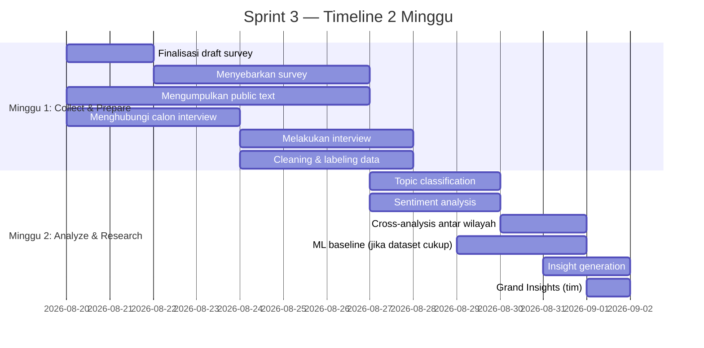
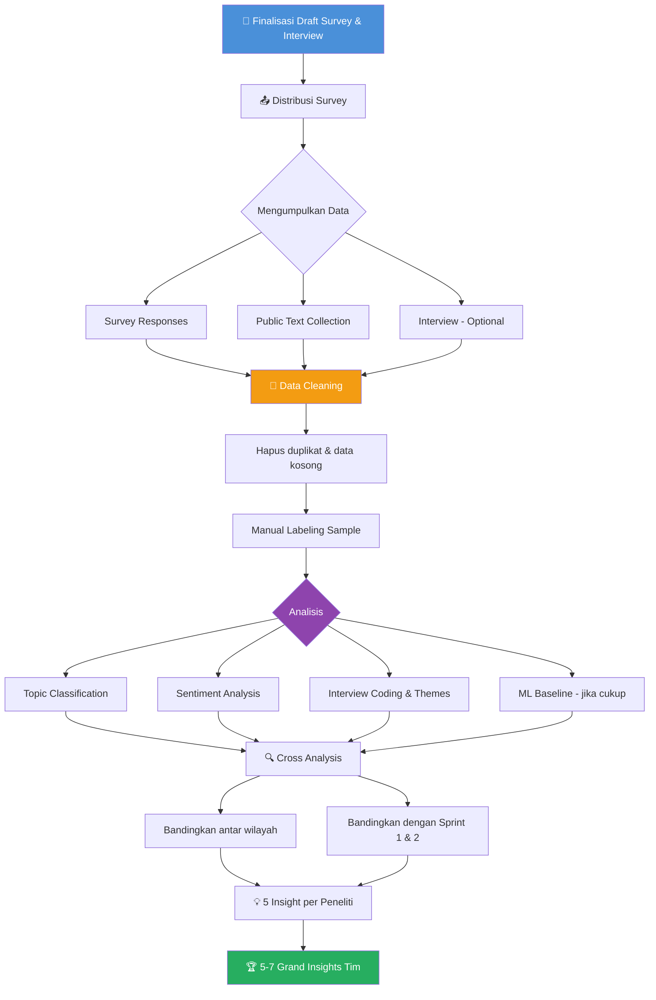

# 📋 Draft Survey & Interview — Sprint 3: Listening to the Ecosystem

> **GRAK 2026 · Data & Research Track**
> Draft untuk diskusi tim — 19 Agustus 2026

---

## 1. Tujuan Survey & Interview

### Research Question Utama
> *Apa tantangan, kebutuhan, dan persepsi utama pelaku startup dan ekosistem digital di Aceh terhadap kondisi ekosistem saat ini?*

### Apa yang Ingin Kita Dapatkan?

| Target | Dari Survey | Dari Interview |
|--------|-------------|----------------|
| **Tantangan utama** | Ranking kuantitatif (top 3 tantangan) | Cerita detail & konteks di balik tantangan |
| **Kebutuhan** | Data proporsi kebutuhan (funding, mentoring, dll) | Contoh nyata kebutuhan yang belum terpenuhi |
| **Persepsi ekosistem** | Skor Likert (1-5) terukur | Nuansa & emosi yang tidak tertangkap angka |
| **Validasi Sprint 1 & 2** | Konfirmasi/bantah pola data sebelumnya | Penjelasan "mengapa" di balik pola tersebut |
| **Text dataset** | Jawaban open-ended → text analysis | Transkrip → coding & thematic analysis |
| **Perbandingan wilayah** | Breakdown respons per region | Perspektif lokal yang unik per wilayah |

### 6 Hypothesis yang Diuji

| # | Hypothesis | Akan Dijawab Oleh |
|---|-----------|-------------------|
| H1 | Akses funding startup specific merupakan salah satu masalah utama | Survey (tantangan) + Interview |
| H2 | Ketersediaan talent menjadi hambatan pertumbuhan | Survey (tantangan) + Interview |
| H3 | Startup di luar Banda Aceh lebih bergantung pada kampus & anchor institution | Survey (cross-tab wilayah) |
| H4 | Program startup belum memiliki follow-up yang cukup kuat | Survey (pengalaman) + Interview |
| H5 | Market access menjadi hambatan scale up | Survey (tantangan) + Interview |
| H6 | Dukungan ke digital marketing > digital product development | Survey (jenis pelatihan) |

---

## 2. Target Responden

### Siapa yang Kita Tuju?

| Kategori | Contoh | Prioritas |
|----------|--------|-----------|
| **Founder / Co-founder** | Founder startup digital aktif di Aceh | ⭐ Utama |
| **Pelaku UMKM Digital** | UMKM yang sudah adopsi digital | ⭐ Utama |
| **Ecosystem Actor** | Mentor, inkubator, komunitas tech | ⭐ Utama |
| **Pemerintah / Akademisi** | Dinas terkait, dosen, pengelola inkubator kampus | Pendukung |
| **Talent / Pekerja Digital** | Developer, designer, digital marketer di Aceh | Pendukung |

### Target Angka

| Instrumen | Target | Catatan |
|-----------|--------|---------|
| **Survey** | 50–100 responden (seluruh tim) | Wajib — sumber primary data utama |
| **Interview** | Minimum 5 (seluruh tim) | Optional — bonus evidence |
| **Public Text** | 300+ text samples | Dari sosmed, berita, jawaban open-ended |

### Distribusi Wilayah Peneliti

| Peneliti | Wilayah | Fokus Riset |
|----------|---------|-------------|
| **Anum** | Aceh Barat, Nagan Raya, Simeulue, Aceh Jaya | Market, digitalization, infrastructure, regional ecosystem |
| **Neni** | Lhokseumawe, Aceh Utara, Bireuen | Campus ecosystem, talent, incubation, survival |
| **Aulia** | Aceh Tengah, Bener Meriah, Aceh Tenggara, Aceh Selatan, Langsa, Subulussalam | Funding, government support, digital adoption, talent |
| **Taris** | Banda Aceh, Aceh Besar | Funding, scaling, government support, program effectiveness |

> [!TIP]
> Aktivitas startup tertinggi di Banda Aceh → target survey Taris bisa lebih besar.

---

## 3. Draft Pertanyaan Survey

Survey terdiri dari **5 section** dengan fungsi berbeda:

### Section A — Profil Responden
*Tujuan: Mengetahui siapa responden agar bisa cross-tab data per wilayah, role, dan pengalaman.*

| # | Pertanyaan | Tipe Jawaban |
|---|-----------|--------------|
| A1 | Di wilayah mana Anda menjalankan bisnis/startup/aktivitas utama? | Dropdown (daftar kabupaten/kota Aceh) |
| A2 | Apa peran Anda saat ini? | Pilihan: Founder/Co-founder · Freelancer/Pekerja Digital · Pelaku UMKM · Pengelola Inkubator/Akselerator · Akademisi · Pemerintah · Komunitas · Lainnya |
| A3 | Berapa lama Anda terlibat di ekosistem startup/bisnis digital di Aceh? | Pilihan: < 1 tahun · 1–3 tahun · 3–5 tahun · > 5 tahun |
| A4 | Apa status bisnis/startup Anda saat ini? | Pilihan: Masih ideation · Sudah punya produk/MVP · Sudah punya revenue · Sudah scaling · Sudah tidak aktif · Tidak memiliki startup |
| A5 | Berapa jumlah anggota tim Anda saat ini? | Pilihan: Solo · 2–5 orang · 6–10 orang · > 10 orang · Tidak memiliki tim |

---

### Section B — Pengalaman di Ekosistem
*Tujuan: Memetakan pengalaman nyata responden dengan program, pendanaan, dan dukungan yang ada.*

| # | Pertanyaan | Tipe Jawaban |
|---|-----------|--------------|
| B1 | Apakah Anda pernah mengikuti program inkubasi, akselerasi, atau pelatihan terkait startup/bisnis digital? | Ya / Tidak |
| B2 | *(Jika Ya)* Program apa yang pernah Anda ikuti? | Jawaban terbuka (text) |
| B3 | *(Jika Ya)* Jenis dukungan atau pelatihan digital apa yang pernah Anda terima? | Checklist: Digital Marketing/Social Media · Product Development · Technology/Coding · Business Development · Funding/Pitching · Mentoring · Lainnya |
| B4 | *(Jika Ya)* Apakah ada follow-up atau pendampingan setelah program selesai? | Pilihan: Ya, ada pendampingan berkelanjutan · Ada, tapi sangat terbatas · Tidak ada sama sekali |
| B5 | Apakah Anda pernah mendapatkan pendanaan (grant, investasi, pinjaman) untuk bisnis/startup? | Ya / Tidak |
| B6 | *(Jika Ya)* Dari mana sumber pendanaan tersebut? | Checklist: Dana pribadi · Keluarga/teman · Grant pemerintah · Investor angel · Venture capital · Kompetisi/award · Lainnya |
| B7 | Apakah Anda pernah mengikuti event startup atau tech community di Aceh? | Ya, rutin · Ya, beberapa kali · Tidak pernah |

---

### Section C — Tantangan
*Tujuan: Mengidentifikasi tantangan utama secara kuantitatif tanpa leading question.*

| # | Pertanyaan | Tipe Jawaban |
|---|-----------|--------------|
| C1 | **Apa tiga tantangan terbesar yang Anda hadapi ketika membangun atau mengembangkan bisnis digital / startup?** *(Pilih maksimal 3)* | Checklist (max 3): Akses Pendanaan (Funding) · Ketersediaan Talent/SDM · Akses Pasar (Market) · Infrastruktur Teknologi · Regulasi & Perizinan · Akses Mentoring · Networking & Koneksi · Customer Acquisition · Product Development · Lainnya *(sebutkan)* |
| C2 | Apa hambatan utama yang membuat bisnis/startup Anda sulit bertahan atau scale up? | Jawaban terbuka (text) → **akan masuk text dataset** |
| C3 | Seberapa mudah mendapatkan talent/SDM digital yang sesuai di wilayah Anda? | Likert 1–5: Sangat Sulit → Sangat Mudah |

---

### Section D — Persepsi Ekosistem (Likert Scale 1–5)
*Tujuan: Mengukur persepsi kuantitatif terhadap kondisi ekosistem. Hasilnya → perception score.*

> Berikan penilaian Anda terhadap pernyataan berikut (1 = Sangat Tidak Setuju, 5 = Sangat Setuju):

| # | Pernyataan | Skala |
|---|-----------|-------|
| D1 | Saya merasa ekosistem Aceh cukup mendukung untuk membangun startup. | 1–2–3–4–5 |
| D2 | Akses terhadap pendanaan khusus startup di Aceh sudah memadai. | 1–2–3–4–5 |
| D3 | Tersedia cukup mentor/pendamping yang memahami kebutuhan startup digital di Aceh. | 1–2–3–4–5 |
| D4 | Program pelatihan digital di Aceh sudah relevan dengan kebutuhan startup/bisnis digital. | 1–2–3–4–5 |
| D5 | Dukungan pemerintah terhadap startup digital di Aceh sudah cukup efektif. | 1–2–3–4–5 |
| D6 | Saya optimis terhadap masa depan startup digital di Aceh. | 1–2–3–4–5 |
| D7 | Komunitas dan jaringan startup di Aceh membantu perkembangan bisnis saya. | 1–2–3–4–5 |
| D8 | Infrastruktur digital (internet, co-working space, dll.) di wilayah saya sudah memadai. | 1–2–3–4–5 |

> [!IMPORTANT]
> **Perception Score** = Rata-rata skor D1–D8 per responden.
> Bisa di-breakdown per wilayah untuk membandingkan persepsi antar region.

---

### Section E — Open-ended
*Tujuan: Mendapatkan text data yang kaya untuk topic classification & sentiment analysis.*

| # | Pertanyaan | Tipe Jawaban |
|---|-----------|--------------|
| E1 | **Jika Anda bisa mengubah satu hal dari ekosistem startup/bisnis digital Aceh, apa yang akan Anda ubah dan mengapa?** | Jawaban terbuka (text) |
| E2 | Apa kebutuhan utama yang menurut Anda belum terpenuhi bagi pelaku startup/bisnis digital di Aceh? | Jawaban terbuka (text) |
| E3 | Ceritakan pengalaman positif atau negatif yang paling berkesan selama menjalankan bisnis/startup di Aceh. | Jawaban terbuka (text) |
| E4 | *(Opsional)* Apakah Anda bersedia dihubungi untuk interview singkat (15–30 menit)? | Ya (+ kontak) / Tidak |

> [!TIP]
> Jawaban Section E menjadi **sumber utama text dataset** untuk topic classification & sentiment analysis.
> Minimal setiap jawaban terbuka menghasilkan 1 text sample → dari 100 responden, potensi 300 text samples dari survey saja.

---

## 4. Draft Panduan Interview

### Format Interview
- **Durasi**: 15–30 menit
- **Sifat**: Semi-structured (ada panduan, tapi fleksibel mengikuti alur percakapan)
- **Target**: Minimum 5 interview untuk seluruh tim
- **Medium**: Tatap muka / video call / telepon
- **Dokumentasi**: Rekam (dengan izin) atau catat langsung

### Pertanyaan Utama

> **"Apa tantangan terbesar ketika membangun startup atau bisnis digital di Aceh?"**

### Follow-up Probing Questions

| # | Follow-up | Fungsi |
|---|----------|--------|
| F1 | "Bisa ceritakan contohnya?" | Mendapatkan cerita konkret |
| F2 | "Apa yang terjadi setelah itu?" | Menggali timeline/dampak |
| F3 | "Bagaimana Anda menyelesaikannya?" | Menggali coping strategy |
| F4 | "Dukungan apa yang pernah Anda dapatkan?" | Memetakan dukungan yang sudah ada |
| F5 | "Apa yang sebenarnya Anda butuhkan?" | Menggali kebutuhan yang belum terpenuhi |
| F6 | "Kalau satu hal bisa diperbaiki dari ekosistem Aceh, apa itu?" | Mendapatkan satu prioritas utama |

### Pertanyaan Tambahan (Sesuai Konteks Responden)

| Untuk | Pertanyaan |
|-------|-----------|
| **Founder** | "Apa yang membuat Anda bertahan di Aceh? Pernah berpikir untuk pindah?" |
| **Founder** | "Bagaimana pengalaman Anda mencari pendanaan?" |
| **Founder** | "Bagaimana Anda mendapatkan tim/talent?" |
| **Ecosystem Actor** | "Menurut Anda, apa yang paling dibutuhkan founder di Aceh saat ini?" |
| **Ecosystem Actor** | "Program atau inisiatif apa yang menurut Anda paling efektif? Mengapa?" |
| **Talent/Pekerja** | "Apa yang membuat Anda tetap bekerja di Aceh vs. pindah ke kota lain?" |

### ⚠️ Yang HARUS Dihindari Saat Interview

| ❌ Jangan | ✅ Lakukan |
|----------|-----------|
| Menyimpulkan dari satu cerita | Catat sebagai **satu evidence**, cari pola di data lain |
| Leading question: "Susah ya cari funding?" | Netral: "Bagaimana pengalaman Anda soal pendanaan?" |
| Memotong responden | Dengarkan, beri jeda, baru follow-up |
| Mengiyakan/menilai jawaban | Respon netral: "Terima kasih, bisa ceritakan lebih lanjut?" |

> [!WARNING]
> **Satu cerita ≠ kesimpulan!**
> Seorang founder bilang "Susah cari developer" ≠ "Talent adalah masalah utama Aceh."
> Itu baru satu evidence — cari pola yang sama di survey, interview lain, public text, dan Sprint 1 & 2.

---

## 5. Workflow Pelaksanaan

### Timeline 2 Minggu

### Workflow Step-by-Step

---

## 6. Cara Menyebarkan Survey

### Strategi Distribusi

| Channel | Cara | Target |
|---------|------|--------|
| **WhatsApp Grup** | Kirim link Google Form ke grup komunitas startup, tech, UMKM digital | Volume tinggi |
| **DM Personal** | Hubungi founder/pelaku yang sudah dikenal dari Sprint 1 & 2 | Response rate tinggi |
| **Komunitas & Inkubator** | Minta bantuan pengelola inkubator/komunitas menyebarkan | Reach luas |
| **LinkedIn / Instagram** | Post di akun peneliti dengan link | Organic reach |
| **Snowball** | Minta responden merekomendasikan responden lain | Menjangkau yang tersembunyi |

### Tips Meningkatkan Response Rate
1. **Subject jelas**: "Survey Ekosistem Startup Aceh 2026 — Bantu Kami Memahami Pengalamanmu (5 menit)"
2. **Jelaskan tujuan**: "Data ini akan menjadi bagian dari State of Startup Ecosystem Aceh 2026"
3. **Estimasi waktu**: Pastikan survey bisa diselesaikan dalam 5–10 menit
4. **Follow-up**: Ingatkan responden yang belum mengisi setelah 3 hari

---

## 7. Cara Mendapatkan Responden Interview

### Sumber Calon Interviewee

| Sumber | Strategi |
|--------|----------|
| **Dari survey** | Tambahkan pertanyaan E4: "Apakah bersedia dihubungi untuk interview?" |
| **Database Sprint 1 & 2** | Founder/pelaku yang sudah diidentifikasi di sprint sebelumnya |
| **Rekomendasi komunitas** | Minta komunitas/inkubator merekomendasikan orang yang relevan |
| **Snowball** | Setelah interview, tanya: "Apakah ada orang lain yang bisa saya ajak bicara?" |

### Template Pesan untuk Menghubungi

> *"Halo [Nama], saya [Nama Peneliti] dari tim GRAK 2026. Kami sedang melakukan riset tentang ekosistem startup digital di Aceh. Apakah Anda bersedia meluangkan waktu 15–30 menit untuk berbagi pengalaman Anda? Wawancara bisa dilakukan melalui [telepon/video call/tatap muka] di waktu yang Anda tentukan. Terima kasih! 🙏"*

---

## 8. Data yang Harus Didapatkan (Deliverables)

| # | Deliverable | Deskripsi | Status |
|---|-------------|-----------|--------|
| 1 | **Survey Dataset** | Responden · role · wilayah · jawaban · perception score | Wajib |
| 2 | **Public Text Dataset** | Text · source · date · topic · sentiment · notes | Wajib |
| 3 | **Topic Classification** | 11 kategori: Funding, Talent, Market, Government, Education, Infrastructure, Community, Technology, Program, Opportunity, Other | Wajib |
| 4 | **Sentiment Analysis** | Positive · Neutral · Negative untuk setiap text | Wajib |
| 5 | **ML Baseline** | TF-IDF + Logistic Regression (jika dataset cukup) | Kondisional |
| 6 | **Interview Dataset** | Minimum 5 interview untuk seluruh tim | Optional |
| 7 | **Insight Report** | Minimal 5 insight per peneliti · 5–7 Grand Insights tim | Wajib |

---

## 9. Format Insight yang Benar

> [!IMPORTANT]
> **Jangan menulis "Funding adalah masalah."** — Gunakan struktur 5 lapis ini:

| Layer | Penjelasan | Contoh |
|-------|-----------|--------|
| **DATA** | Apa yang ditemukan | "62% responden memilih funding sebagai salah satu dari tiga tantangan utama." |
| **PATTERN** | Pola yang muncul | "Funding menjadi tema yang paling sering muncul di survey dan text dataset." |
| **INTERPRETATION** | Apa artinya | "Akses terhadap modal menjadi perhatian yang cukup konsisten." |
| **INSIGHT** | Yang kita pelajari | "Startup specific funding masih menjadi salah satu kebutuhan utama pelaku ekosistem Aceh." |
| **EVIDENCE** | Data pendukung | "Survey + text classification + temuan Sprint 2." |

---

## 10. Poin Diskusi untuk Meeting Tim

> [!NOTE]
> Berikut hal-hal yang perlu dibahas dan diputuskan bersama tim malam ini:

### 🔴 Harus Diputuskan Malam Ini

- [ ] **Finalisasi pertanyaan survey** — ada yang perlu ditambah/dikurangi/diubah?
- [ ] **Platform survey** — Google Form? Typeform? Lainnya?
- [ ] **Deadline distribusi survey** — kapan mulai sebar? Kapan deadline response?
- [ ] **Pembagian target responden** — siapa menghubungi siapa per wilayah?

### 🟡 Perlu Dibicarakan

- [ ] **Bahasa survey** — Bahasa Indonesia formal atau semi-formal?
- [ ] **Apakah perlu informed consent** di awal survey?
- [ ] **Interview** — siapa yang akan coba mengejar interview? Masing-masing berapa?
- [ ] **Public text** — platform apa saja yang akan diambil? (Instagram, YouTube, LinkedIn, X, berita)
- [ ] **Koordinasi labeling** — apakah labeling dilakukan bersama untuk konsistensi?

### 🟢 Nice to Discuss

- [ ] **Apakah pertanyaan survey perlu di-pilot test** ke 3–5 orang dulu sebelum disebar?
- [ ] **Template spreadsheet** — format dataset yang seragam untuk semua peneliti
- [ ] **Jadwal check-in** — kapan tim sync progress minggu depan?

---

> **Prinsip Utama Sprint 3:**
> *"Sprint 1 & 2 membangun peta. Sprint 3 memberikan suara pada peta tersebut."*
> 
> Kita bukan hanya mengumpulkan data — kita mendengarkan orang-orang yang hidup dan bekerja di dalam ekosistem tersebut.
